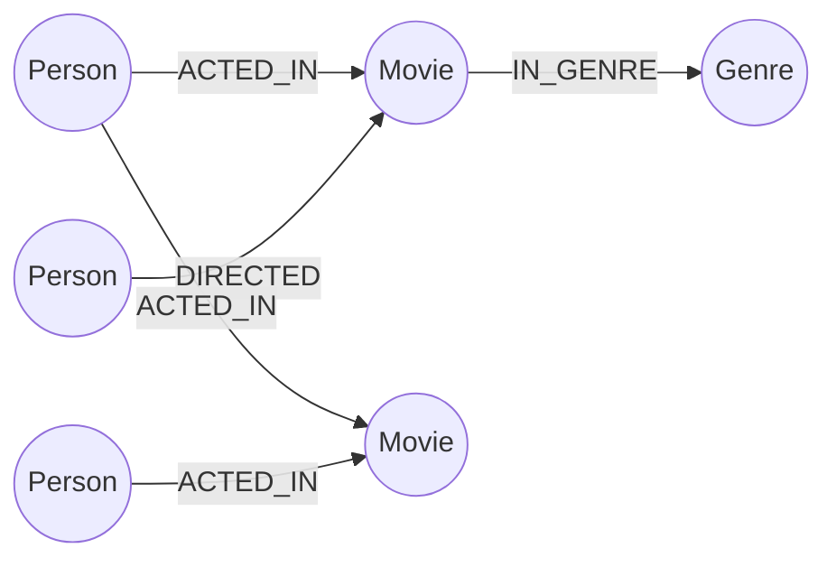

# 🎬 Movie Graph — CognoDB Take-Home Assignment

A full-stack web application for exploring movies, people (actors & directors) and genres through their
**connections** — built on top of [CognoDB](https://console.cognodb.com), a managed graph database that
speaks openCypher over the Bolt protocol.

- 🔗 **Live demo (frontend):** https://movie-graph-front.vercel.app/
- 🔗 **Live demo (backend API):** https://movie-graph-backend.vercel.app/api/health
- 🔗 **Repository:** https://github.com/Mohamed-Atef-Elhawary/movie-graph-app

---

## 📌 The use case

**Movie Graph** lets a user browse movies, open a movie's detail page to see its cast, director and genres,
and jump from a person to everyone else they've worked with. The interesting question the app answers is not
"what movies exist" (a simple table) but **"who is connected to whom, and how"** — e.g. *"which actors have
worked with this actor, even indirectly?"* or *"what other movies fit this one's taste profile, based on
shared people and genres?"*

## 🤔 Why a graph database?

A relational schema would need at least four tables (`movies`, `people`, `genres`, plus junction tables
`acted_in`, `directed`, `movie_genres`) just to model who did what. Answering a question like *"actors who
worked with an actor who worked with X"* means chaining multiple self-joins across the junction table — the
SQL gets long, the query planner has to do multiple nested joins, and performance degrades as the network of
collaborations grows.

In a graph model, a collaboration isn't computed at query time — it's a relationship that already exists in
the data. Traversing "two people away" is just walking two edges:

```cypher
MATCH (p1:Person {name: $name})-[:ACTED_IN]->(:Movie)<-[:ACTED_IN]-(:Person)-[:ACTED_IN]->(:Movie)<-[:ACTED_IN]-(p2:Person)
WHERE p1 <> p2
RETURN DISTINCT p2.name
```

This is the kind of query a relational database handles awkwardly (multiple self-joins, harder to read, harder
to optimize) but a graph database was built for. The same applies to recommendations: "movies that share a
person *or* a genre with this one" is a natural pattern match in Cypher, not a stack of `UNION`s and `JOIN`s.

## 🧩 Data model

**Nodes**
| Label | Properties |
|---|---|
| `Movie` | `title`, `year`, `rating` |
| `Person` | `name` |
| `Genre` | `name` |

**Relationships**
| Relationship | Direction | Meaning |
|---|---|---|
| `(:Person)-[:ACTED_IN]->(:Movie)` | Person → Movie | Person appeared in the movie |
| `(:Person)-[:DIRECTED]->(:Movie)` | Person → Movie | Person directed the movie |
| `(:Movie)-[:IN_GENRE]->(:Genre)` | Movie → Genre | Movie belongs to a genre |



## 🗃️ Main queries

| Purpose | Highlights |
|---|---|
| List all movies | Simple `MATCH (m:Movie) RETURN m` used for the home page grid |
| Movie details | Fetches a movie plus its cast, director and genres in one traversal |
| **Multi-hop traversal (2+ hops)** | Finds people connected to a given person through a shared collaborator — `Person → Movie → Person → Movie → Person` |
| **Relational-unfriendly query** | Recommends movies that share *either* a person *or* a genre with a given movie, ranked by how many connections they share — awkward to express and slow to run as repeated self-joins in SQL |

All queries are executed through the official **Neo4j JavaScript driver**, using parameters (`$param`) rather
than string-concatenated Cypher, so user input is never interpolated directly into a query.


- **Backend:** Node.js + Express, using the official `neo4j-driver` package to talk to CognoDB over
  `bolt+s://`. Deployed on Vercel as a serverless function.
- **Frontend:** Angular, deployed separately on Vercel, calling the backend's REST API.
- **Error handling:** if the database is unreachable, the backend fails the connection check and returns a
  clear error response instead of crashing silently; the frontend shows an error/empty state instead of a
  blank screen.

## 🔐 Environment variables

Connection details are never committed to the repository. The backend reads them from environment variables:

```
COGNODB_URI=bolt+s://<instance-id>.databases.cognodb.cloud
COGNODB_USER=cognodb
COGNODB_PASSWORD=<your generated password>
PORT=5000
```

Locally these live in `backend/.env` (git-ignored). On Vercel, they're set under **Project → Settings →
Environment Variables**.

## ⚙️ Setup & run locally

### 1. Create your own CognoDB instance
1. Sign up at [console.cognodb.com/signup](https://console.cognodb.com/signup) (no credit card required).
2. Create a free **c0** instance and pick a region.
3. Copy the **Connection URI** and the generated **password** for user `cognodb` — the password is shown once.

### 2. Backend
```bash
cd backend
npm install
# create a .env file as shown above
node seed.js      # loads seed data into your CognoDB instance
node server.js    # starts the API on http://localhost:5000
```

### 3. Frontend
```bash
cd frontEnd
npm install
ng serve
```
By default the app runs on `http://localhost:4200` and calls the backend at the URL configured in
`src/app/services/movie-service.ts` / environment config.

## 📸 Screenshots

**Home — browsing movies**
![Home page]


**Movie details**
![Movie details page]


## 🎥 Demo video
A short screen recording walking through the app is available here: *[add link]*

---

Built by **Mohamed Atef Elhaware** for the Wexa AI CognoDB take-home assignment.
